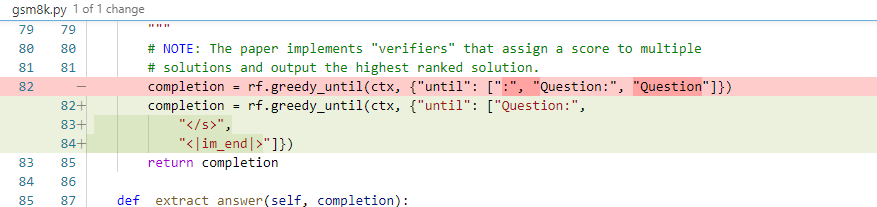
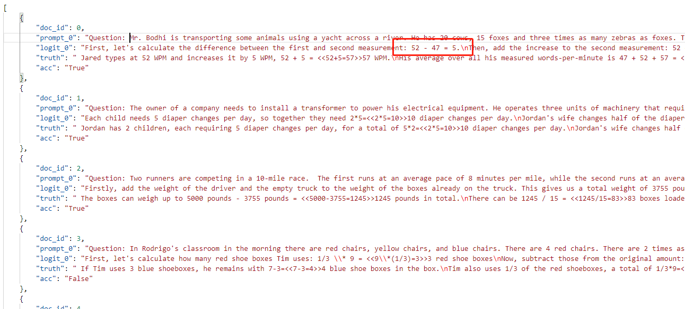

# `Mistral-Pro` evaluation harness

Fork of the Eleuther LM Evaluation Harness used in [Mistral-Pro-8B-v0.1](https://huggingface.co/TencentARC/Mistral_Pro_8B_v0.1).

## Environment Setup

You can run the following code to set up the environment.

```bash
pip install -r requirements.txt
```

## Running the evaluation 

See `scripts/leaderboard.sh` for an entrypoint to running evaluation on a model from the HuggingFace Hub.

The script can be used through the following command:
```bash
bash scripts/leaderboard.sh YOUR_MODEL_PATH YOUR_MODEL_NAME
```

Refer to `lm_eval/tasks` directory for their associated implementations.

## Tasks Supported

Below, we detail all evaluation benchmarks used in the [Open-LLM-Leaderboard](https://huggingface.co/spaces/HuggingFaceH4/open_llm_leaderboard). 

* ARC: 25-shot, arc-challenge (acc_norm)
* HellaSwag: 10-shot, hellaswag (acc_norm)
* TruthfulQA: 0-shot, truthfulqa-mc (mc2)
* MMLU: 5-shot (average of all the results acc)
* Winogrande: 5-shot, winogrande (acc)
* GSM8k: 5-shot, gsm8k (acc)

## Main Difference between [Open-LLM-Leaderboard](https://huggingface.co/spaces/HuggingFaceH4/open_llm_leaderboard)

The main difference between the version used by [Open-LLM-Leaderboard](https://huggingface.co/spaces/HuggingFaceH4/open_llm_leaderboard) is the truncation word in GSM8K. The version used by [Open-LLM-Leaderboard](https://huggingface.co/spaces/HuggingFaceH4/open_llm_leaderboard) will be truncated when the output token is ":" as the following figure's red part shows, while this repo adopts the green part to do the truncation. The truncation word of the green part is from the latest version of [lm-evaluation-harness](https://github.com/EleutherAI/lm-evaluation-harness).



Here is one example that the output will be truncated too early so that we use the latest version of [lm-evaluation-harness](https://github.com/EleutherAI/lm-evaluation-harness)'s truncation word to run the test.

